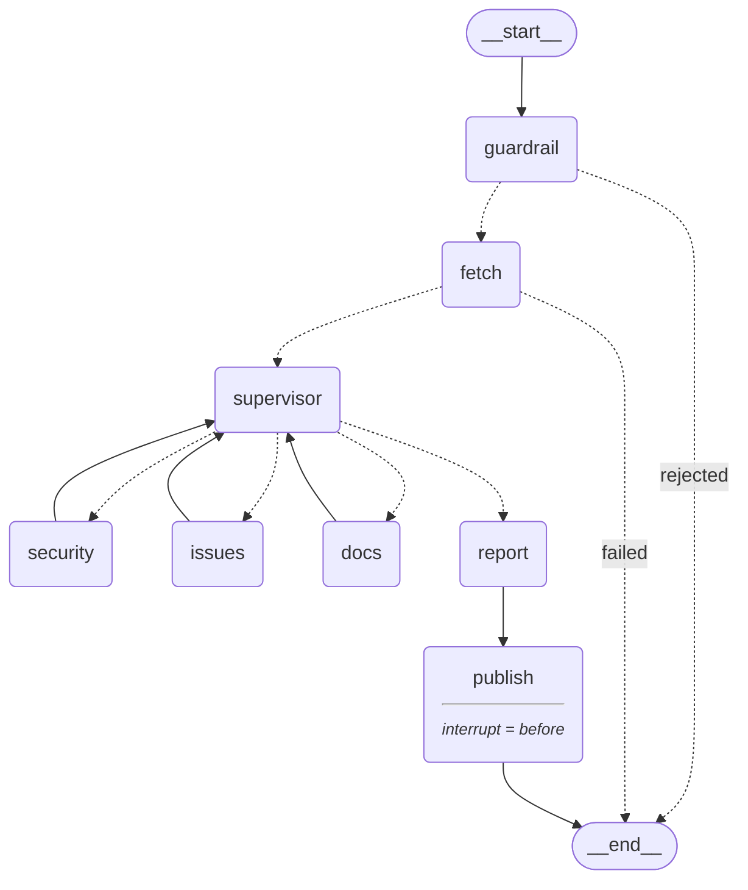

# معمارية النظام — الجزء الثاني من البريف (٢٠% من الدرجة)

> المخطط أدناه مولَّد من الـ graph المُصرَّف نفسه عبر
> `python scripts/export_architecture.py` — فلا يمكن أن يخالف الكود.



**الحلقة هي جوهر التصميم:** المشرف لا يشغّل الوكلاء الثلاثة بترتيب ثابت، بل يعود
إليه التحكّم بعد كل وكيل ليقرّر — بناءً على ما وُجد حتى الآن — من يعمل تالياً أو
متى نتوقف.

---

## ١. الـ nodes ومسؤولياتها

| node | المسؤولية | الملف |
|---|---|---|
| `guardrail` | يتحقق أن المدخل رابط مستودع GitHub صالح، ويرفض ما عداه برسالة مؤدبة بلغة المستخدم قبل أي استدعاء خارجي | `graph/guardrail.py` |
| `fetch` | يجلب بيانات المستودع مرة واحدة ويضعها في الـ state | `graph/fetch.py` |
| `supervisor` | يحسب أي وكيل يملك مادة ليعمل عليها، ثم يسأل النموذج عن الأولوية والتوقف، ثم يتحقق من قراره قبل تنفيذه | `graph/supervisor.py` |
| `security` | يفحص ملفات التبعيات في OSV.dev، ويمسح الكود بحثاً عن مفاتيح مكشوفة | `graph/agents.py` |
| `issues` | يفرز البلاغات: المكرر — بما فيه المرفوع مرتين بالعربية والإنجليزية — والمهمل والأولويات | `graph/agents.py` |
| `docs` | يقيس README مقابل أربعة معايير: ما المشروع، التثبيت، التشغيل، الترخيص | `graph/agents.py` |
| `report` | يجمّع الملاحظات المتراكمة ويصوغ التقرير بلغة المستخدم، ويكتب عنوان البلاغ ونصّه | `graph/report.py` |
| `publish` | الوحيد الذي يكتب في العالم الخارجي — لا يعمل إلا بعد موافقة بشرية صريحة | `graph/build.py` |

## ٢. المسارات الشرطية — وما تفحصه بالضبط

| الدالة | ما تفحصه | المخرجات الممكنة |
|---|---|---|
| `route_after_guardrail` | هل `rejection_reason` ليس `None`؟ | `rejected → END` \| `fetch` |
| `route_after_fetch` | هل ملأ node الجلب `rejection_reason`؟ | `failed → END` \| `supervisor` |
| `route_from_supervisor` | قيمة `next_agent` — أهي اسم وكيل أم `"done"`؟ | `security` \| `issues` \| `docs` \| `report` |

اثنان ينهيان التنفيذ مبكراً، والثالث هو الحلقة. كلها تغيّر المسار فعلياً لا شكلياً.

## ٣. الـ State — ما يتراكم وما يُستبدل

| الحقل | النوع | السلوك | من يكتبه |
|---|---|---|---|
| `repo_url` | `str` | مدخل | المستخدم |
| `language` | `str` | مدخل — `"en"` أو `"ar"` | المستخدم |
| `owner` / `repo` | `str` | يُستبدل | `guardrail` |
| `rejection_reason` | `Optional[str]` | يُستبدل | `guardrail` · `fetch` |
| `repo_data` | `dict` | يُكتب مرة واحدة | `fetch` |
| `next_agent` | `str` | يُستبدل كل دورة | `supervisor` |
| `agents_done` | `Annotated[list[str], add]` | **يتراكم** | كل وكيل يضيف اسمه |
| `findings` | `Annotated[list[dict], add]` | **يتراكم** | كل وكيل |
| `supervisor_log` | `Annotated[list[str], add]` | **يتراكم** | كل node — أثر التتبّع |
| `report` | `str` | يُستبدل | `report` · مسارات الرفض |
| `issue_title` / `issue_body` | `str` | يُستبدل | `report` |
| `approved` | `Optional[bool]` | يضبطه الإنسان | الـ backend عند الاستئناف |
| `issue_url` | `Optional[str]` | يُستبدل | `publish` |

ثلاثة حقول فقط تتراكم عبر `operator.add`؛ البقية تُستبدل. هذا الفرق هو ما يسمح
لثلاثة وكلاء بالكتابة في الـ state دون أن يمحو أحدهم عمل الآخر.

## ٤. الأدوات والأنظمة الخارجية

| الأداة | مربوطة بـ | النظام الخارجي | ماذا تفعل |
|---|---|---|---|
| `fetch_repo_data` | `fetch` | **GitHub REST** | البيانات الوصفية، README، البلاغات، ملفات التبعيات والكود |
| `check_vulnerabilities` | `security` | **OSV.dev** | ثغرات معروفة لكل حزمة، مع معرّفات GHSA/CVE كدليل |
| `scan_secrets` | `security` | محلي | أنماط المفاتيح المكشوفة، والمقتطف مقنَّع جزئياً |
| `open_issue` | `publish` | **GitHub REST — كتابة** | يفتح بلاغاً حقيقياً — الفعل الوحيد غير القابل للتراجع |

ثلاث أدوات تلمس نظاماً خارجياً حقيقياً، ولا واحدة منها ترجع بيانات معلّبة.

## ٥. الاستمرارية وتدخّل الإنسان

الـ graph مُصرَّف بـ `MemorySaver` و `interrupt_before=["publish"]`. عند وصول
التنفيذ إلى `publish` يتوقّف ويُحفَظ تحت `thread_id`، فيقرأ المستخدم التقرير
كاملاً **قبل** أن يُكتب أي شيء على مستودع الغير.

| الخطوة | ما يجري |
|---|---|
| `POST /analyze` | ينادي `invoke` فيتوقف الـ graph قبل النشر، ويرجع التقرير و `thread_id` بحالة `awaiting_approval` |
| — انتظار — | الحالة محفوظة في الـ checkpointer. المستخدم يقرأ ويقرّر بلا حدّ زمني |
| `POST /approve` | `update_state(config, {"approved": …})` ثم `invoke(None, config)` — يُستأنف من نقطة التوقف نفسها |
| `approved = false` | يعمل `publish` ويخرج فوراً بـ `issue_url = None`. لا شيء يُكتب |

## ٦. مسارات الفشل

| العطل | أين | التصرّف |
|---|---|---|
| رابط ليس مستودع GitHub | `guardrail` | رسالة رفض مؤدبة بلغة المستخدم، ونهاية فورية — بلا أي استدعاء خارجي |
| `RepoNotFound` | `fetch` | يشرح أن المستودع غير موجود أو خاص، وينهي التنفيذ قبل تشغيل أي وكيل |
| عطل شبكة أو حدّ استعلامات | `fetch` | يترجم الاستثناء لرسالة مفهومة، ويؤكّد أنها مشكلة عندنا لا ملاحظة على المستودع |
| نجاح الأداة برجوع لا شيء | `fetch` | يعامَل كفشل: لا README ولا تبعيات ولا كود ⇒ لا شيء يُحلَّل |
| الـ LLM غير متاح | `supervisor` | **لا يتوقف** — يسقط على ترتيب حتمي: الأمن ثم البلاغات ثم التوثيق |
| النموذج يختار وكيلاً غير مؤهَّل أو منفَّذاً | `supervisor` | يُصحَّح القرار قبل التوجيه. ولو أراد التوقف قبل عمل أي وكيل، يُرفض — التقرير الفارغ ممنوع |
| `MissingToken` عند النشر | `publish` | التقرير يبقى سليماً، و `issue_url = None` مع سبب واضح. فشل الكتابة لا يُسقط التحليل |

القاعدة واحدة: النظام يشرح ما جرى **ولا يخترع نتيجة أبداً**.

---

## لماذا وكيل؟ — إخراج فعلي لا ادّعاء

الترتيب الحتمي المكتوب في `_FALLBACK_ORDER` هو `security → issues → docs`.
على مستودع الاختبار قرأ النموذج الإشارات وبدأ بـ `issues`، وعلّل اختياره:

```
supervisor: [llm] issues   — open issues that may be duplicates, which could
                             help prioritize fixes...
supervisor: [llm] security — crucial to identify vulnerabilities, given the
                             presence of a requirements file.
supervisor: [llm] docs     — the README is very short and likely lacks
                             important information.
supervisor: [rule] done    — no eligible agent left
```

استدعاء واحد بـ prompt ثابت لا يُنتج هذا، وسكربت بقواعد ثابتة كان سيشغّل الثلاثة
بالترتيب نفسه على كل مستودع.

**تكلفة هذا القرار مقيسة:** ١٣.٥% من توكِنات الدخل — أي ١.٢١ هللة للتحليل الواحد.
التفاصيل في `docs/PRODUCT.md`، والسجل الكامل في `proof_graph.txt`.
